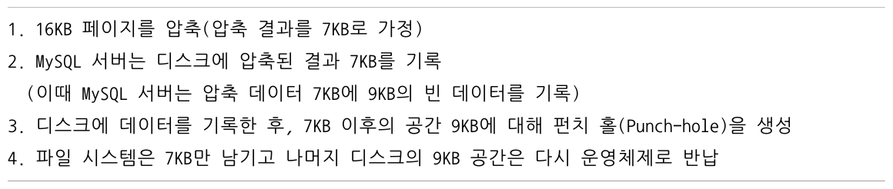

# 데이터 압축

디스크에 저장된 데이터 파일의 크기 → (쿼리의 처리 성능 + 백업 및 복구 시간)에 영향

많은 DBMS가 이런 문제점을 해결하기 위해 데이터 압축 기능 제공

  

## 페이지 압축(Transparent Page Compression)

### Transparent

- 데이터 압축은 MySQL 서버가 디스크에 저장하는 시점에 데이터 페이지가 압축되어 저장됨
- 데이터 압축해제는 MySQL 서버가 디스크에서 데이터 페이지를 읽어오는 시점에 발생함

  

→ 버퍼 풀에 데이터 페이지가 한 번 적재되면 InnoDB 스토리지 엔진은 압축이 해제된 상태로만 데이터 페이지를 관리함

→ MySQL 서버 내부 코드에서 압축 여부와 관계없이 **투명(Transparent)**하게 작동

  

하지만, 16KB 데이터 페이지를 압축한 용량이 얼마나 될 지 예측이 블가능하기 때문에 적어도 하나의 테이블은 동일한 크기의 페이지(블록)로 통일돼야 함

  

### 펀치 홀(Punch hole)

- 실제 압축에서 페이지 압축이 사용되지 않는 이유
- 하나의 테이블을 동일한 크기의 페이지로 통일 가능
- 운영체제별로 특정 버전의 파일 시스템에서만 지원됨

  

**페이지 압축 동작방식(운영체제의 블록 사이즈가 512 바이트인 경우)**

  

  

- 실제 디스크의 공간은 7KB만 차지함
- 운영체제에서 16KB를 읽으면 압축된 데이터 7KB과 펀치 홀 공간 9KB를 합쳐서 16KB를 읽음

  

**문제점**

- 운영체제뿐만 아니라 하드웨어 자체에서도 해당 기능을 지원해야 사용 가능
- 아직 파일 시스템 관련 명령어가 펀치 홀을 지원하지 않음
    - 펀치홀을 생성하더라도 다른 파일 관련 유틸리티들에 의해 데이터가 채워질 수 있음

  

### 사용법

페이지 압축을 사용하기 위해서는 `COMPRESSION`  옵션을 설정하면 됨

```sql
# 테이블 생성 시
CREATE TABLE tq (c1 INT) COMPRESSION="zlib";

# 테이블 변경 시
ALTER TABLE t1 COMPRESSION="zlib";
OPTIMIZE TABLE t1;
```

  

## 테이블 압축

- pros
    - 운영체제나 하드웨어에 대한 제약 없이 사용 가능 → 활용도 높음
    - 디스크의 데이터 파일 크기를 줄일 수 있음
- cons
    - 버퍼 풀 공간 활용률 낮음
    - 쿼리 처리 성능이 낮음
    - 빈번한 데이터 변경 시 압축률 떨어짐

  

단점들이 발생하는 이유를 이해하려면 다음 내용을 먼저 이해해야 함

- 내부적으로 어떻게 압축이 실행되어 디스크에 저장되는지
- 압축된 데이터 페이지들이 버퍼 풀에 어떻게 적재되어 사용되는지

  

### 압축 테이블 생성

전제 조건: 압축을 사용하려는 테이블이 별도의 테이블 스페이스를 사용

- `innodb_file_per_table`  시스템 변수를 ON으로 설정
- 테이블 생성 시 `ROW_FORMAT=COMPRESSED`  옵션을 명시해야 함
- InnoDB 스토리지 엔진의 페이지 크기가 16KB → `KEY_BLOCK_SIZE` 는 4KB 또는 8KB만 설정 가능
- 페이지 크기가 32KB 또는 64KB인 경우 테이블 압축 적용할 수 없음

```bash
SET GLOBAL innodb_file_per_table=ON;

// ROW_FORAMT 옵션과 KEY_BLOCK_SIZE 옵션을 모두 명시
CREATE TABLE compressed_table(
    c1 INT PRIMARY KEY
    )
    ROW_FORMAT=COMPRESSED
    KEY_BLOCK_SIZE=8;

// KEY_BLOCK_SIZE 옵션만 명시
CREATE TABLE compressed_table(
    c1 INT PRIMARY KEY
    )
    KEY_BLOCK_SIZE=8;
```

- `KEY_BLOCK_SIZE`  옵션만 명시⁠하는 경우 `ROW_FORAMT⁠`  옵션 생략 가능

  

### 테이블 압축 동작방식

  

- 테이블 압축에서 InnoDB 스토리지 엔진의 InnoDB I/O 레이어에서는 아무런 역할을 하지 않음
- 목표 크기(KEY\_BLOCK\_SIZE)가 잘못 설정되면 MySQL 서버의 처리 성능이 급격히 떨어질 수 있음

  

### KEY\_BLOCK\_SIZE 결정

압축된 결과가 어느 정도가 될 지를 예측해서 `KEY_BLOCK_SIZE`  결정

1. 테이블 압축 전 `KEY_BLOCK_SIZE` 를 4KB 또는 8KB로 테이블을 생성
2. 생성된 테이블에 샘플 데이터를 저장해보고 적절한지 판단
    - 샘플 데이터가 많으면 많을 수록 정확한 테스트 가능
    - 최소한 테이블의 데이터 페이지가 10개 정도는 생성되도록 테스트 데이터를 INSERT 해보는 게 좋음
3. 1~2 과정을 반복하여 `KEY_BLOCK_SIZE` 를 결정
    - 압축 실패율이 3~5% 미만으로 유지할 수 있게 `KEY_BLOCK_SIZE` 를 선택하는 게 좋음

  

### 압축 실패율이 높으면 압축을 사용하지 말아야 하는가?

성능에 민감한 서비스의 경우 일반적으로 압축 실패율이 높으면 테이블 압축을 하지 않는 게 좋음

하지만 압축 실패율이 높다고 해서 압축을 사용하지 말아야 한다는 것을 의미하지는 않음

- (압축 O) INSERT만 되는 로그 테이블의 경우
    - 한 번 INSERT 되면 이 후 다시는 변경되지 않음
    - 한 번 정도는 압축 시도가 실패해서 페이지 스플릿 후 재압축 한다고 하더라도 전체적으로 데이터 파일의 크기가 큰 폭으로 줄어든다면 큰 손해는 아님
- (압축 X) 압축 실패율이 그다지 높지 않은 경우
    - 테이블의 데이터가 매우 빈번하게 조회되고 변경된다면 압축은 고려하지 않는 게 좋음

  

테이블 압축은 zlib을 이용해 압축을 실행하는데, 예상 외로 압축 알고리즘은 많은 CPU 자원을 소모함

  

### 압축된 페이지의 버퍼 풀 적재 및 사용

InnoDB 스토리지 엔진은 압축된 테이블의 데이터 페이지를 버퍼 풀에 적재하면 압축된 상태와 압축이 해제된 상태 2개 버전을 관리함

- 디스크에서 읽은 상태 그대로의 데이터 페이지 목록을 관리하는 LRU 리스트
    - 압축이 적용되지 않은 테이블의 데이터 페이지
    - 압축이 적용된 테이블의 압축된 데이터 페이지
- 압축된 페이지들의 압축 해제 버전인 Unzip\_LRU 리스트
    - 압축이 적용된 테이블의 압축된 데이터 페이지

  

**테이블 압축 문제점**

- InnoDB 스토리지 엔진은 압축된 테이블에 대해서는 버퍼 풀의 공간을 이중으로 사용 → 메모리 낭비
- 압축된 페이지에서 데이터를 읽거나 변경 → 압축 해제 비용 높음

  

**문제 해결**

Unzip\_LRU 리스트를 별도로 관리하고 있다가 MySQL 서버로 유입되는 요청 패턴에 따라서 적절히(Adaptive) 다음과 같은 처리를 수행함

- InnoDB 버퍼 풀의 공간이 필요한 경우 LRU 리스트에서 원본 데이터 페이지는 유지하고, Unzip\_LRU 리스트에서 압축 해제된 버전은 제거해서 버퍼 풀의 공간 확보
- 압축된 데이터 페이지가 자주 사용되는 경우 Unzip\_LRU 리스트에 압축 해제된 페이지를 계속 유지하면서 압축 및 압축 해제 작업 최소화
- 압축된 데이터 페이지가 사용되지 않아서 LRU 리스트에서 제거되는 경우 Unzip\_LRU 리스트에서도 함께 제거

  

**어댑티브 알고리즘**

InnoDB 스토리지 엔진은 버퍼 풀에서 압축 해제된 버전의 데이터 페이지를 적절한 수준으로 유지하기 위해 어댑티브 알고리즘을 사용함

- CPU 사용량이 높은 서버에서는 가능하면 압축과 압축 해제를 피하기 위해 Unzip\_LRU의 비율을 높여서 유지
- Disk IO 사용량이 높은 서버에서는 가능하면 Unzip\_LRU 리스트의 비율을 낮춰서 InnoDB 버퍼 풀의 공간을 더 확보하도록 작동

  

#MySQL