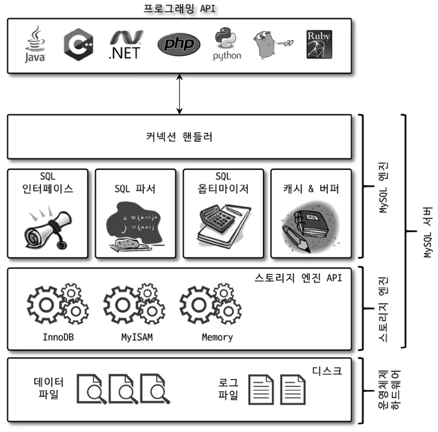

# 아키텍처

MySQL 서버는 사람의 머리 역할을 담당하는 **MySQL 엔진**과 손발 역할을 담당하는 **스토리지 엔진**으로 구분된다.

그리고 스토리지 엔진은 핸들러 API를 만족하면 누구든지 스토리지 엔진을 구현해서 MySQL 서버에 추가해서 사용할 수 있다.

  

## MySQL 엔진 아키텍처

**MySQL 서버 전체 구조**  



  

**MySQL 엔진**

MySQL 엔진은 클라이언트로부터의 접속 및 쿼리 요청을 처리하는 커넥션 핸들러와

SQL 파서 및 전처리기, 쿼리의 최적화된 실행을 위한 옵티마이저가 중심을 이룬다.

  

**스토리지 엔진**

MySQL 엔진은 요청된 SQL 문장을 분석하거나 최적화하는 부분을 담당하고,

스토리지 엔진은 실제 데이터를 디스크 스토리지에 저장하거나 디스크 스토리지로부터 데이터를 읽어오는 부분을 담당한다.

MySQL 엔진은 하나지만, 스토리지 엔진은 여러 개를 동시에 사용할 수 있다.

  

테이블이 사용할 스토리진 엔진을 지정하면 이후 해당 테이블의 모든 읽기 작업이나 변경 작업은 정의된 스토리지 엔진이 처리한다.

```
# 테이블 생성 시 스토리지 엔진 지정
CREATE TABLE test_table (fd1 INT, fd2 INT) ENGINE=INNODB;
```

**핸들러 API**

MySQL 엔진의 쿼리 실행기에서 데이터를 쓰거나 읽어야 할 때는 각 스토리지 엔진에 쓰기 또는 읽기를 요청하는데,

이러한 요청을 **핸들러 요청**이라 하고, 여기서 사용되는 API를 **핸들러 API**라고 한다.

> 💡 핸들러 요청 : 스토리지 엔진에 대한 쓰기 또는 읽기 요청
> 
> 💡 핸들러 API : 핸들러 요청에 사용되는 API

  

* * *

## MySQL 스레딩 구조

**MySQL 스레딩 모델**  

  

  

MySQL 서버는 프로세스 기반이 아닌 스레드 기반으로 작동하며,

크게 **포그라운드 스레드**와 **백그라운드 스레드**로 구분된다.

```
# 실행중인 스레드 확인
mysql> SELECT thread_id, name, type, processlist_user, processlist_host FROM performance_schema.threads ORDER BY type, thread_id;
+-----------+---------------------------------------------+------------+------------------+------------------+
| thread_id | name                                        | type       | processlist_user | processlist_host |
+-----------+---------------------------------------------+------------+------------------+------------------+
|         1 | thread/sql/main                             | BACKGROUND | NULL             | NULL             |
|         2 | thread/mysys/thread_timer_notifier          | BACKGROUND | NULL             | NULL             |
|         4 | thread/innodb/io_ibuf_thread                | BACKGROUND | NULL             | NULL             |
|         5 | thread/innodb/io_log_thread                 | BACKGROUND | NULL             | NULL             |
|         6 | thread/innodb/io_read_thread                | BACKGROUND | NULL             | NULL             |
|         7 | thread/innodb/io_read_thread                | BACKGROUND | NULL             | NULL             |
|         8 | thread/innodb/io_read_thread                | BACKGROUND | NULL             | NULL             |
|         9 | thread/innodb/io_read_thread                | BACKGROUND | NULL             | NULL             |
|        10 | thread/innodb/io_write_thread               | BACKGROUND | NULL             | NULL             |
|        11 | thread/innodb/io_write_thread               | BACKGROUND | NULL             | NULL             |
|        12 | thread/innodb/io_write_thread               | BACKGROUND | NULL             | NULL             |
|        13 | thread/innodb/io_write_thread               | BACKGROUND | NULL             | NULL             |
|        14 | thread/innodb/page_flush_coordinator_thread | BACKGROUND | NULL             | NULL             |
|        15 | thread/innodb/log_checkpointer_thread       | BACKGROUND | NULL             | NULL             |
|        16 | thread/innodb/log_flush_notifier_thread     | BACKGROUND | NULL             | NULL             |
|        17 | thread/innodb/log_flusher_thread            | BACKGROUND | NULL             | NULL             |
|        18 | thread/innodb/log_write_notifier_thread     | BACKGROUND | NULL             | NULL             |
|        19 | thread/innodb/log_writer_thread             | BACKGROUND | NULL             | NULL             |
|        24 | thread/innodb/srv_lock_timeout_thread       | BACKGROUND | NULL             | NULL             |
|        25 | thread/innodb/srv_error_monitor_thread      | BACKGROUND | NULL             | NULL             |
|        26 | thread/innodb/srv_monitor_thread            | BACKGROUND | NULL             | NULL             |
|        27 | thread/innodb/buf_resize_thread             | BACKGROUND | NULL             | NULL             |
|        28 | thread/innodb/srv_master_thread             | BACKGROUND | NULL             | NULL             |
|        29 | thread/innodb/dict_stats_thread             | BACKGROUND | NULL             | NULL             |
|        30 | thread/innodb/fts_optimize_thread           | BACKGROUND | NULL             | NULL             |
|        31 | thread/mysqlx/acceptor_network              | BACKGROUND | NULL             | NULL             |
|        32 | thread/mysqlx/worker                        | BACKGROUND | NULL             | NULL             |
|        33 | thread/mysqlx/worker                        | BACKGROUND | NULL             | NULL             |
|        37 | thread/innodb/buf_dump_thread               | BACKGROUND | NULL             | NULL             |
|        38 | thread/innodb/clone_gtid_thread             | BACKGROUND | NULL             | NULL             |
|        39 | thread/innodb/srv_purge_thread              | BACKGROUND | NULL             | NULL             |
|        40 | thread/innodb/srv_worker_thread             | BACKGROUND | NULL             | NULL             |
|        41 | thread/innodb/srv_worker_thread             | BACKGROUND | NULL             | NULL             |
|        42 | thread/innodb/srv_worker_thread             | BACKGROUND | NULL             | NULL             |
|        44 | thread/mysqlx/acceptor_network              | BACKGROUND | NULL             | NULL             |
|        47 | thread/sql/con_sockets                      | BACKGROUND | NULL             | NULL             |
|        43 | thread/sql/event_scheduler                  | FOREGROUND | event_scheduler  | localhost        |
|        46 | thread/sql/compress_gtid_table              | FOREGROUND | NULL             | NULL             |
|      3097 | thread/sql/one_connection                   | FOREGROUND | root             | localhost        |

...

|      3272 | thread/sql/one_connection                   | FOREGROUND | root             | localhost        |
+-----------+---------------------------------------------+------------+------------------+------------------+
61 rows in set (0.01 sec)
```

  

전체 61개의 스레드가 실행 중이며, 36개의 스레드가 백그라운드 스레드이고, 25개의 스레드가 포그라운드 스레드이다.

‘thread/sql/one\_connection’ 스레드는 실제 사용자의 요청을 처리하는 포그라운드 스레드다.

백그라운드 스레드의 개수는 MySQL 서버의 설정에 따라 가변적일 수 있다.

동일한 이름의 스레드가 2개 이상씩 보이는 건 MySQL 설정에 의해 여러 스레드가 동일 작업을 병렬로 처리하는 경우다.

  

**포그라운드 스레드(클라이언트 스레드)**

포그라운드 스레드는 최소한 MySQL 서버에 접속된 클라이언트의 수만큼 존재하며,

주로 각 클라이언트 사용자가 요청하는 쿼리 문장을 처리한다.

포그라운드 스레드는 데이터를 MySQL의 데이터 버퍼나 캐시로부터 가져오며,

버퍼나 캐시에 없는 경우 직접 디스크의 데이터나 인덱스 파일로부터 데이터를 읽어와서 작업을 처리한다.

  

**백그라운드 스레드**

MyISAM의 경우에는 별로 해당 사항이 없는 부분이지만 InnoDB는 다음과 같이 여러 가지 작업이 백그라운드로 처리된다.

- 인서트 버퍼를 병합하는 스레드
- \***로그를 디스크로 기록하는 스레드**
- InnoDB 버퍼 풀의 데이터를 디스크에 기록하는 스레드
- \***데이터를 버퍼로 읽어 오는 스레드**
- 잠금이나 데드락을 모니터링하는 스레드

  

InnoDB에서 데이터를 읽는 작업은 주로 클라이언트에서 처리되기 때문에 읽기 스레드는 많이 설정할 필요 없지만,

쓰기 스레드는 아주 많은 작업을 백그라운드로 처리하기 때문에 디스크를 최적으로 사용할 수 있을 만큼 적절하게 설정하는 게 좋다.

데이터 쓰기 작업은 지연(버퍼링)되어 처리될 수 있지만 데이터 읽기 작업은 절대 지연될 수 없다.

일반적인 상용 DBMS에는 대부분 쓰기 작업을 버퍼링해서 일괄 처리하는 기능이 탑재돼 있다.

InnoDB는 이러한 방식으로 처리하는 데 반해, MyISAM은 그렇지 않고 사용자 스레드가 쓰기 작업까지 함께 처리하도록 설계돼 있다.

  

* * *

  

## 메모리 할당 및 사용 구조

**MySQL 메모리 사용 및 할당 구조**  

  

  

MySQL에서 사용되는 메모리 공간은 크게 **글로벌 메모리 영역**과 **로컬 메모리 영역**으로 구분할 수 있다.

글로벌 메모리 영역의 모든 메모리 공간은 MySQL 서버가 시작되면서 운영체제로부터 할당된다.

글로벌 메모리 영역과 로컬 메모리 영역은 MySQL 서버 내 존재하는 많은 스레드가 공유해서 사용하는 공간인지 여부에 따라 구분된다.

  

**글로벌 메모리 영역**

일반적으로 클라이언트 스레드의 수와 무관하게 하나의 메모리 공간만 할당된다.

생성된 글로벌 영역이 $$N$$ 개라 하더라도 모든 스레드에 의해 공유된다.

- 테이블 캐시
- InnoDB 버퍼 풀
- InnoDB 어댑티브 해시 인덱스
- InnoDB 리두 로그 버퍼

  

**로컬 메모리 영역**

세션 메모리 영역이라고도 표현하며, MySQL 서버상에 존재하는 클라이언트 스레드가 쿼리를 처리하는 데 사용하는 메모리 영역이다.

로컬 메모리는 각 클라이언트 스레드별로 독립적으로 할당되며 절대 공유되어 사용되지 않는다.

로컬 메모리 공간은 각 쿼리의 용도별로 필요할 때만 할당되고,

필요하지 않은 경우에는 MySQL이 메모리 공간을 할당조차도 하지 않을 수 있다.

커넥션이 열려 있는 동안 계속 할당된 상태로 남아 있는 공간도 있고(커넥션 버퍼나 결과 버퍼)

쿼리를 실행하는 순간에만 할당했다가 다시 해제하는 공간(소트 버퍼나 조인 버퍼)도 있다.

- 정렬 버퍼
- 조인 버퍼
- 바이너리 로그 캐시
- 네트워크 버퍼

  

* * *

⁠⁠

## 플러그인 스토리지 엔진 모델

**MySQL 플러그인 모델**  

  

  

MySQL은 이미 기본적으로 많은 스토리지 엔진을 가지고 있지만,

수많은 사용자의 요구 조건을 만족시키기 위해 이외에 부가적인 기능을 더 제공하는 스토리지 엔진이 필요할 수 있다.

이러한 요건을 기초로 다른 전문 개발 회사 또는 사용자가 직접 스토리지 엔진을 개발하는 것도 가능하다.

  

**MySQL 엔진과 스토리지 엔진의 처리 영역**  

  

  

MySQL에서 쿼리가 실행되는 과정은 거의 대부분의 작업이 MySQL 엔진에서 처리되고,

마지막 ‘데이터 읽기/쓰기’ 작업만 스토리지 엔진에 의해 처리된다.

MySQL에서 MyISAM이나 InnoDB와 같이 다른 스토리지 엔진을 사용하는 테이블에 대해 쿼리를 실행하더라도 MySQL의 처리 내용은 대부분 동일하며, 단순히 ‘데이터 읽기/쓰기’ 영역의 처리 차이만 있을 뿐이다.

실질적인 `GROUP BY`나 `ORDER BY` 등 복잡한 처리는 스토리지 엔진 영역이 아니라,

MySQL 엔진의 처리 영역인 ‘쿼리 실행기’에서 처리된다.

그렇다고 MyISAM이나 InnoDB 스토리지 엔진 가운데 뭘 사용하든 별 차이가 없는 건 아니다.

단순해 보이는 ‘데이터 읽기/쓰기’ 작업 처리 방식의 차이가 결과에 큰 영향을 미친다.

  

* * *

  

## 컴포넌트

MySQL 8.0부터는 기존의 플러그인 아키텍처를 대체하기 위해 컴포넌트 아키텍처가 지원된다.

MySQL 서버의 플러그인은 다음과 같은 몇 가지 단점이 있다. 컴포넌트는 이러한 단점들을 보완해서 구현됐다.

- 플러그인은 오직 MySQL 서버와 인터페이스할 수 있고, 플러그인끼리는 통신할 수 없음
- 플러그인은 MySQL 서버의 변수나 함수를 직접 호출하기 때문에 안전하지 않음(캡슐화 안 됨)
- 플러그인은 상호 의존 관계를 설정할 수 없어서 초기화가 어려움

  

* * *

  

## 쿼리 실행 구조

**쿼리 실행 구조**  

  

**쿼리 파서**

사용자 요청으로 들어온 쿼리 문장을 토큰으로 분리해 트리 형태의 구조로 만들어 내는 작업을 수행한다.

쿼리 문장의 기본 문법 오류는 이 과정에서 발견되고 사용자에게 오류 메시지를 전달하게 된다.

**전처리기**

파서 과정에서 만들어진 파서 트리를 기반으로 쿼리 문장에 구조적인 문제점이 있는지 확인한다.

각 토큰을 테이블 이름이나 칼럼 이름, 또는 내장 함수와 같은 개체를 매핑해

해당 객체의 존재 여부와 객체의 접근 권한 등을 확인하는 과정을 이 단계에서 수행한다.

**옵티마이저**

사용자의 요청으로 들어온 쿼리 문장을 저렴한 비용으로 가장 빠르게 처리할 지를 결정하는 역할 담당한다.

DBMS의 두뇌에 해당한다. 그만큼 옵티마이저의 역할은 중요하고 영향 범위 또한 아주 넓다.

**실행 엔진**

옵티마이저가 두뇌라면 실행 엔진과 핸들러는 손과 발에 비유할 수 있다.

실행 엔진은 만들어진 계획대로 각 핸들러에게 요청해서 받은 결과를 또 다른 핸들러 요청의 입력으로 연결하는 역할을 수행한다.

**핸들러(스토리지 엔진)**

MySQL 서버 가장 밑단에서 MySQL 실행 엔진의 요청에 따라 데이터를 디스크로 저장하고 디스크로부터 읽어 오는 역할을 담당한다.

핸들러는 결국 스토리지 엔진을 의미하며, MyISAM 테이블을 조작하는 경우에는 핸들러가 MyISAM 스토리지 엔진이 되고,

InnoDB 테이블을 조작하는 경우에는 핸들러가 InnoDB 스토리지 엔진이 된다.

  

* * *

  

이외 주요 아키텍처로는 복제, 쿼리 캐시, 스레드 풀, 트랜잭션 지원 메타데이터가 있다.

  

## 쿼리 캐시

SQL의 실행 결과를 메모리 캐시하고, 동일 SQL 쿼리가 실행되면 테이블을 읽지 않고 즉시 결과를 반환한다.

데이터의 변경은 없고 읽기만 하는 환경에서는 매우 빠른 성능을 보이지만,

그렇지 않은 환경에서는 변경된 데이터에 관련된 모든 것들을 삭제해야 하는 동시 처리 성능 저하를 유발하기 때문에,

MySQL 8.0부터는 MySQL 서버의 기능에서 완전히 제거되어, 사용되지 않는다.

  

## 스레드 풀

스레드 풀은 엔터프라이즈 에디션에서만 제공하고, 커뮤니티 에디션은 지원되지 않는다.

커뮤니티 에디션에서 스레드 풀 기능을 사용하고자 한다면,

동일 버전의 Percona Server에서 스레드 풀 플러그인 라이브러리를 설치해서 사용하면 된다.

  

스레드 풀은 내부적으로 사용자의 요청을 처리하는 스레드 개수를 줄여서 동시 처리되는 요청이 많다 하더라도,

MySQL 서버의 CPU가 제한된 개수의 스레드 처리에만 집중할 수 있게 해서 서버의 자원 소모를 줄이는 것이 목적이다.

하지만 스케줄링 과정에서 CPU 시간을 제대로 확보하지 못하는 경우에는 쿼리 처리가 더 느려질 수 있다는 점에 주의하자.

  

제한된 수의 스레드만으로 CPU가 처리하도록 적절히 유도한다면 CPU의 프로세서 친화도도 높이고,

(일반적으로 CPU 코어의 개수와 맞추는 것이 CPU 프로세서 친화도를 높이는 데 좋다.)

운영체제 입장에서는 불필요한 컨텍스트 스위를 줄여 오버헤드를 낮출 수 있다.

  

스레드 그룹의 모든 스레드가 일을 처리하고 있다면,

스레드 풀은 새로운 작업 스레드를 추가할 지, 기존 작업 스레드가 처리를 완료할 때까지 기다릴 지 여부를 판단한다.

시스템 변수 thread\_pool\_stall\_limit, thread\_pool\_max\_threads를 설정하여 앞서 언급한 작업을 수행할 수 있다.

  

Percona Server의 스레드 풀은 선순위 큐와 후순위 큐를 이용해 특정 트랜잭션이나 쿼리를 우선적으로 처리할 수 있는 기능도 제공한다.

먼저 시작된 트랜잭션 내에 속한 SQL을 빨리 처리해주면 해당 트랜잭션이 가지고 있던 잠금이 빨리 해제되고,

잠금 경합을 낮춰 전체적인 처리 성능을 향상시킬 수 있다.

  

## 트랜잭션 지원 메타데이터

데이터베이스 서버에서 테이블의 구조 정보와 스토어드 프로그램 등의 정보를 데이터 딕셔너리 또는 메타데이터라고 하는데,

MySQL 5.7 버전까지는 테이블 구조 및 스토어드 프로그램을 파일 기반으로 관리했다.

하지만 이러한 파일 기반 메타데이터는 생성 및 변경 작업이 트랜잭션을 지원하지 않기 때문에,

MySQL 서버가 비정상적으로 종료되면 일관되지 않은 상태로 남는 문제가 있었다.

  

MySQL 8.0 버전부터는 이러한 문제점을 해결하기 위해,

테이블의 구조 정보나 스토어드 프로그램의 코드 관련 정보를 모두 InnoDB의 테이블에 저장하도록 개선됐다.

  

MySQL 8.0 버전부터는 **시스템 테이블**을 모두 InnoDB 스토리지 엔진을 사용하도록 개선했으며,

시스템 테이블과 데이터 딕셔너리 정보를 모두 모아 `mysql` DB에 저장하고 있다.

> 💡 시스템 테이블  
> : MySQL 서버가 작동하는 데 기본적으로 필요한 모든 테이블, 대표적으로 사용자의 인증과 권한에 관련되 테이블이 있음

  

* * *

## InnoDB 스토리지 엔진 아키텍처

InnoDB는 MySQL에서 사용할 수 있는 스토리진 엔진 중 거의 유일하게 **레코드 기반의 잠금**을 제공하며,

그 때문에 높은 동시성 처리가 가능하고 안정적이며 성능이 뛰어나다.

  

**InnoDB 구조**  

  

  

* * *

  

## 프라이머리 키에 의한 클러스터링

InnoDB의 모든 테이블은 기본적으로 프라이머리 키를 기준으로 클러스링되어 저장된다.

즉, 프라이머리 키 값의 순서대로 디스크에 저장된다는 뜻이며,

모든 세컨더리 인덱스는 레코드의 주소 대신 프라이머리 킬의 값을 논리적인 주소로 사용한다.

MyISAM 스토리지 엔진에서는 클러스터링 키를 지원하지 않는다.

그래서 MyISAM 테이블에서는 프라이머리 키와 세컨더리 인덱스는 구조적으로 아무런 차이가 없다.

  

* * *

  

## 외래 키 지원

외래 키는 부모 테이블과 자식 테이블 모두 해당 칼럼에 인덱스 생성이 필요하고,

변경 시에는 반드시 부모 테이블이나 자식 테이블에 데이터가 있는지 체크하는 작업이 필요하므로 잠금이 여러 테이블로 전파된다.

그로 인해 데드락이 발생할 때가 많으므로 개발할 때 외래 키의 존재에 주의하는 것이 좋다.

  

* * *

  

## MVCC(Multi Version Concurrency Control)

MVCC의 가장 큰 목적은 잠금을 사용하지 않는 일관된 읽기를 제공하는 데 있다.

InnoDB는 언두 로그(Undo log)를 이용해 이 기능을 구현한다.

> 💡 멀티 버전(Multi Version)  
> : 하나의 레코드에 대해 동시에 관리되는 여러 개의 버전  

  

격리 수준에 따라 MySQL 서버에서 InnoDB 스토리지 엔진을 사용하는 테이블의 데이터 변경을 어떻게 처리하는지 살펴보자.

```
# member 테이블 생성
CREATE TABLE member (
	m_id INT NOT NULL,
	m_name VARCHAR(20) NOT NULL,
	m_area VARCHAR(100) NOT NULL,
	PRIMARY KEY (m_id),
	INDEX ix_area (m_area)
);
```

  

**InnoDB의 버퍼 풀과 데이터 파일의 상태**  

  

  

```
# member 테이블에 UDPATE 문장 실행
UPDATE member SET m_area='경기' WHERE m_id=12;
```

  

**UPDATE 후 InnoDB 버퍼 풀과 데이터 파일 및 언두 영역의 변화**  

  

  

디스크의 데이터 파일에는 체크포인트나 InnoDB의 Write 스레드에 의해 새로운 값을 업데이트돼 있을 수도 있고 아닐 수도 있지만,

InnoDB가 **ACID**를 보장하기 때문에 일반적으로 InnoDB 버퍼 풀과 데이터 파일은 동일한 상태라고 가정해도 무방하다.

  

[(GPT) **InnoDB의 ACID가 뭐야?**](https://www.notion.so/GPT-InnoDB-ACID-da180ddd9f9e44f282701162ff1e4ca6?pvs=21)

  

```
# COMMIT이나 ROLLBACK이 되지 않은 상태에서 레코드 조회
SELECT * FROM member WHERE m_id=12;
```

  

격리 수준에 따라 조회 동작이 다르다.

격리 수준이 `READ_UNCOMMITTED`인 경우에는 InnoDB 버퍼 풀이 현재 가지고 있는 변경된 데이터를 읽어서 반환한다.

반대로, `READ_COMMITED`나 그 이상의 격리 수준인 경우에는 변경되기 이전의 내용을 보관하고 있는 언두 영역의 데이터를 반환한다.

이러한 과정을 **MVCC**라고 표현한다.

즉, 하나의 레코드에 대해 2개의 버전이 유지되고, 필요에 따라 어느 데이터가 보여지는지 여러 가지 상황에 따라 달라지는 구조다.

  

이 상태에서 `COMMIT` 명령을 실행하면 InnoDB는 더 이상의 변경 작업 없이 지금의 상태를 영구적인 상태로 만들어 버린다.

하지만 `ROLLBACK`을 실행하면 InnoDB는 언두 영역에 있는 백업된 데이터를 InnoDB 버퍼 풀로 다시 복구하고,

언두 영역의 내용르 삭제해 버린다.

즉, 커밋이 된다고 언두 영역의 백업 데이터가 바로 삭제되는 것은 아니다.

이 언두 영역을 필요로 하는 트랜잭션이 더는 없을 때 비로소 삭제된다.

  

* * *

  

## 잠금 없는 일관된 읽기(Non-Locking Consistent Read)

InnoDB 스토리지 엔진의 MVCC 기술은 잠금을 걸지 않고 읽기 작업을 가능케 한다.

오랜 시간 동안 활성 상태인 트랜잭션으로 인해 MySQL 서버가 느려지거나 문제가 발생할 때가 가끔 있는데,

바로 이러한 일관된 읽기를 위해 언두 로그를 삭제하지 못하고 계속 유지해야 하기 때문에 발생하는 문제다.

트랜잭션이 시작되면 가능한 한 빨리 롤백이나 커밋을 통해 트랜잭션을 완료하는 게 좋다.

  

* * *

  

## 자동 데드락 감지

InnoDB 스토리지 엔진은 내부적으로 잠금이 교착 상태에 빠지지 않았는지 체크하기 위해,

잠금 대기 목록을 그래프(Wait-for List) 형태로 관리한다.

InnoDB 스토리지 엔진의 데드락 감지 스레드가 주기적으로 잠금 대기 그래프를 검사해,

교착 상태에 빠진 트랜잭션들을 찾아서 그중 하나를 강제 종료한다.

언두 로그 레코드를 더 적게 가진 트랜잭션이 일반적으로 롤백의 대상이 된다.

  

PK 또는 세컨더리 인덱스를 기반으로 매우 높은 동시성 처리를 요구하는 서비스가 있다면,

`innodb_deadlock_detect`를 비활성화해서 성능을 개선할 수 있다.

  

* * *

  

## 자동화된 장애 복구

InnoDB에는 손실이나 장애로부터 데이터를 보호하기 위한 여러 가지 메커니즘이 탑재돼 있다.

그러한 메커니즘을 이용하여 MySQL 서버가 시작될 때 완료되지 못한 트랜잭션이나,

디스크에 일부만 기록된 데이터 페이지 등에 대한 일련의 복구 작업이 자동으로 진행된다.

  

InnoDB 스토리지 엔진은 매우 견고해서 데이터 파일이 손상되거나 MySQL 서버가 시작되지 못하는 경우는 거의 발생하지 않지만,

디스크나 하드웨어 이슈로 InnoDB 스토리지 엔진이 자동으로 복구를 못 하는 경우도 발생할 수 있다.

이 때에는 복구를 위해 MySQL 서버의 설정 파일에 `Innodb_force_recovery` 시스템 변수를 설정해서 MySQL 서버를 재시작해야 한다.

이 설정을 통해 데이터 파일이나 로그 파일의 손상 여부 검사 과정을 선별적으로 진행할 수 있다.

이 값이 커질수록 심각한 상황이어서 데이터 손실 가능성이 커지고 복구 가능성은 적어진다.

  

* * *

  

## InnoDB 버퍼 풀

InnoDB 스토리지 엔진에서 가장 핵심적인 부분으로, 디스크의 데이터 파일이나 인덱스 정보를 메모리에 캐시해 두는 공간이다.

쓰기 작업을 지연시켜 일괄 작업으로 처리할 수 있게 해주는 버퍼 역할도 같이 한다.

  

**버퍼 풀의 크기 설정**

전체 커넥션 개수와 각 커넥션에서 읽고 쓰는 테이블의 개수에 따라서 결정된다.

또한 이 버퍼 공간은 동적으로 해제되기도 하므로 정확히 필요한 메모리 공간의 크기를 계산할 수 없다.

가능하면 InnoDB 버퍼 풀의 크기를 적절히 작은 값으로 설정해서 조금씩 상황을 봐 가면서 증가시키는 방법이 최적이다.

InnoDB 버퍼 풀은 여러 개로 쪼개어 관리할 수 있다. 버퍼 풀이 여러 개의 작은 버퍼 풀로 쪼기지면서,

개별 버퍼 풀 전체를 관리하는 잠금(세마포어) 자체도 경합이 분산되는 효과를 내게 된다.

  

**버퍼 풀의 구조**

InnoDB 스토리지 엔진은 버퍼 풀이라는 거대한 메모리 공간을 페이지 크기의 조각으로 쪼개어,

InnoDB 스토리지 엔진이 데이터를 필요로 할 때 해당 데이터 페이지를 읽어서 각 조각에 저장한다.

버퍼 풀의 페이지 크기 조작을 관리하기 위해 InnoDB 스토리지 엔진은,

크게 **LRU(Least Recently Used) 리스트**와 **플러시(Flush) 리스트**, **프리(Free) 리스트**라는 3개의 자료 구조를 관리한다.

> 💡 프리(Free) 리스트
> 
> : InnoDB 버퍼 풀에서 실제 사용자 데이터로 채워지지 않은 비어 있는 페이지들의 목록, 사용자의 쿼리가 새롭게 디스크의 데이터 페이지를 읽어와야 하는 경우 사용됨
> 
> 💡 LRU(Least Recently Used) 리스트
> 
> : 엄밀하게는 LRU(Least Recently Used)와 MRU(Most Recently Used) 리스트가 결함된 형태, 디스크로부터 한 번 읽어온 페이지를 최대한 오랫동안 InnoDB 버퍼 풀의 메모리에 유지해서 디스크 읽기를 최소화함
> 
> 💡 플러시(Flush) 리스트
> 
> : 디스크로 동기화되지 않은 데이터를 가진 데이터 페이지의 변경 시점의 페이지 목록을 관리한다.

  

**버퍼 풀 관리를 위한 LRU 리스트 구조**  

  

  

처음 한 번 읽힌 데이터 페이지가 이후 자주 사용된다면 InnoDB 버퍼 풀의 MRU 영역에서 계속 살아남게 되고,

반대로 거의 사용되지 않는다면 새롭게 디스크에서 읽히는 데이터 페이지들에 밀려서 LRU의 끝으로 밀려나 제거된다.

플러시 리스트는 일단 한 번 데이터 변경이 가해진 데이터 페이지는 관리하고, 특정 시점이 되면 디스크로 기록되게 한다.

데이터가 변경되면 InnoDB는 변경 내용을 리두 로그에 기록하고 버퍼 풀의 데이터 페이지에도 변경내용을 반영하지만,

리두 로그가 디스크로 기록됐다고 해서 데이터 페이지가 디스크로 기록되는 걸 항상 보장하지는 않는다.

  

**버퍼 풀과 리두 로그**

InnoDB의 버퍼 풀과 리두 로그는 매우 밀접한 관계를 맺고 있다.

InnoDB 버퍼 풀은 데이터베이스 서버의 성능 향상을 위해 데이터 캐시와 쓰기 버퍼링이라는 두 가지 용도가 있다.

버퍼 풀의 메모리 공간만 단순히 늘리는 건 데이터 캐시 기능만 향상시키는 것이다.

쓰기 버퍼링 기능까지 향상시키려면 InnoDB 버퍼 풀과 리두 로그와의 관계를 먼저 이해해야 한다.

  

**InnoDB 버퍼 풀과 리두 로그의 관계**  

  

  

**버퍼 풀 플러시(Buffer Pool Flush)**

InnoDB 스토리지 엔진은 버퍼 풀에서 아직 디스크로 기록되지 않은 더티 페이지들을,

성능상의 악영향 없이 디스크에 동기화하기 위해 다음과 같이 2개의 플러시 기능을 백그라운드로 실행한다.

- 플러시 리스트(Flush\_list) 플러시
    - 주기적으로 호출되어 플러시 리스트에서 오래전에 변경된 데이터 페이지 순서대로 디스크에 동기화
    - 언제부터 얼마나 많은 더티 페이지를 한 번에 디스크로 기록하느냐에 따라 사용자의 쿼리 처리가 악영향을 받지 않으면서 부드럽게 처리됨
- LRU 리스트(LRU\_list) 플러시
    - LRU 리스트에서 사용 빈도가 낮은 데이터 페이지들을 제거해서 새로운 페이지들을 읽어올 공간을 만듦
    - LRU 리스트의 끝부분부터 시작해서 최대 설정된 개수만큼의 페이지들을 스캔하면서 더티 페이지는 디스크에 동기화하게 하며, 클린 페이지는 즉시 프리(Free) 리스트로 페이지를 옮김

  

> 💡 클리너 스레드(Cleaner Thread)  
> : InnoDB 스토리지 엔진에서 더티 페이지를 디스크로 동기화하는 스레드  

  

**버퍼 풀 상태 백업 및 복구**

버퍼 풀이 잘 **워밍업**된 상태에서는 그렇지 않은 경우보다 몇십 배의 쿼리 처리 속도를 보이는 것이 일반적이다.

> 💡 워밍업(Warming Up)  
> : 디스크의 데이터가 버퍼 풀에 적재돼 있는 상태

  

InnoDB 스토리지 엔진은 MySQL 서버가 셧다운되기 직전에 버퍼 풀의 백업을 실행하고,

MySQL 서버가 시작되면 자동으로 백업된 버퍼 풀의 상태를 복구할 수 있는 기능을 제공한다.

  

**버퍼 풀의 적재 내용 확인**

`information_schema` 데이터베이스에 `innodb_cached_indexes` 테이블을 이용하여,

테이블의 인덱스별로 데이터 페이지가 얼마나 InnoDB 버퍼 풀에 적재돼 있는지 확인할 수 있다.

  

* * *

  

## Double Write Buffer

리두 로그가 페이지의 변경되 내용만 변경함에 따라 더티 페이지를 디스크 파일로 플러시할 때,

일부만 기록되는 문제가 발생하면 그 페이지의 내용은 복구할 수 없을 수도 있다.

이렇게 페이지가 일부만 기록되는 현상을 파셜 페이지 또는 톤 페이지라고 한다.

> 💡 파셜 페이지(Partial-page) 또는 톤 페이지(Torn-page)  
> : 페이지가 일부만 기록되는 현상, 하드웨어의 오작동이나 시스템의 비정상 종료 등으로 발생할 수 있음  

  

이러한 현상을 막기 위해 InnoDB 스토리지 엔진에서는 Double-Write 기법을 사용한다.

  

**Double Wirte 작동 방식**  

  

  

* * *

## 언두 로그

> 💡 언두 로그(Undo Log)  
> : 트랜잭션과 격리 수준을 보장하기 위해 DML로 변경되기 이전 버전의 백업된 데이터  

  

**언두 로그 용도**

- 트랜잭션 보장 : 트랜잭션 롤백 시 언두 로그에 백업해둔 이전 버전의 데이터를 이용해 복구
- 격리 수준 보장 : 특정 커넥션에서 변경중인 데이터를 다른 커넥션에서 조회 시 트랜잭션 격리 수준에 맞게 언두 로그를 이용하여 데이터 반환

  

MySQL 8.0부터는 언두 로그를 돌아가면서 순차적으로 사용해 디스크 공간을 줄이는 것도 가능하며,

때로는 MySQL 서버가 필요한 시점에 사용 공간을 자동을 줄여 주기도 한다.

이전 버전까지 언급됐던 언두 로그 공간의 문제점은 완전히 해결됐다.

하지만 여전히 서비스 중인 MySQL 서버에서 활성 상태의 트랜잭션이 장시간 유지되는 건 성능상 좋지 않으므로, 언두 로그 레코드가 얼마나 되는지 항상 모니터링하는 것이 좋다.

```
# 언두 로그 레코드 건수 확인
SHOW ENGINE INNODB STATUS \G
```

**언두 테이블스페이스 관리**

> 💡 언두 테이블스페이스(Undo Tablespace)  
> : 언두 로그가 저장되는 공간  

  

MySQL 5.6 버전에서 `innodb_undo_tablespaces` 시스템 변수가 도입되면서,

`innodb_undo_tablespaces` 시스템 변수를 2보다 큰 값으로 설정하면,

InnoDB 스토리지 엔진은 언두 로그를 더이상 테이블 스페이스에 저장하지 않고 별도의 언두 로그 파일을 사용한다.

MySQL 8.0으로 업그레이드되면서 해당 시스템 변수는 더 이상 효력이 없어졌으며,

언두 로그는 항상 시스템 테이블스페이스 외부의 별도 로그 파일에 기록되도록 개선됐다.

  

**언두 테이블스페이스 구조**  

  

  

언두 테이블스페이스의 불필요한 공간을 잘라내 반납하는 것을 ‘Undo tablespace truncate’라고 한다.

자동과 수동으로 잘라내는 두 가지 방법이 있다.

- 자동 모드
    - 퍼지 스레드는 주기적으로 깨어나서 언두 로그 공간에서 불필요해진 언두 로그를 삭제하는 작업을 실행
    - 자동 모드의 경우, 퍼지 스레드는 주기적으로 언두 로그 파일에서 사용되지 않는 공간을 잘라내고 운영체제로 반납
- 수동 모드
    - 자동 모드가 아니거나 자동 모드인데 공간 반납이 부진한 경우에는 언두 테이블스페이스를 비활성화
    - 퍼지 스레드는 비활성 상태의 언두 테이블 스페이스를 찾아서 불필요한 공간을 잘라내고 해당 공간을 운영체제로 반납

  

* * *

  

## 체인지 버퍼

RDBMS에서 레코드가 INSERT, UPDATE 될 때는 데이터 파일 변경뿐 아니라,

해당 테이블의 인덱스를 업데이트하는 작업도 필요하다.

이 작업은 랜덤하게 디스크를 읽어야 하므로 상당히 많은 자원을 소모하게 되는데,

InnoDB가 변경해야 할 인덱스 페이지가 버퍼 풀에 있으면 바로 업데이트를 수행하지만,

디스크로부터 읽어와서 업데이트해야 한다면 이를 즉시 실행하지 않고,

임시 공간에 저장해 두고 결과를 사용자에게 반환하는 형태로 성능을 향상시키게 되는데,

이 때 사용하는 임시 메모리 공간을 **체인지 버퍼**(Change Buffer)라고 한다.

> 💡 체인지 버퍼 머지 스레드(Merge thread)  
> : 체인지 버퍼에 임시로 저장된 인덱스 레코드 조각을 병합하는 백그라운드 스레드  

  

* * *

## 리두 로그 및 로그 버퍼

리두 로그(Redo Log)는 트랜잭션의 4가지 요소인 ACID 중에서 D(Durable)에 해당하는 영속성과 가장 밀잡하게 연관돼 있다.

MySQL 서버가 비정상 종료되었을 때 데이터 파일에 기록되지 못한 데이터를 잃지 않게 해주는 안전장치다.

데이터베이스 서버는 ACID도 중요하지만 성능도 중요하기 때문에 데이터 파일뿐만 아니라,

리두 로그를 버퍼링할 수 있는 InnoDB 버퍼 풀이나 리두 로그를 버퍼링할 수 있는 로그 버퍼와 같은 자료구조도 가지고 있다.

  

MySQL 서버가 비정상 종료되는 경우 InnoDB 스토리지 엔진의 데이터 파일은,

다음과 같은 종류의 일관되지 않은 데이터를 가질 수 있다.

1. 커밋됐지만 데이터 파일에 기록되지 않은 데이터
    - 리두 로그에 저장된 데이터를 데이터 파일에 다시 복사하면 됨
2. 롤백됐지만 데이터 파일에 이미 기록된 데이터
    - 변경되기 전 데이터를 가진 언두 로그의 내용을 가져와 데이터 파일에 복사하면 됨
    - 해당 변경이 커밋됐는지, 롤백됐는지, 아니면 트랜잭션의 실행 중간 상태였는지를 확인하기 위해 리두 로그가 필요할 수 있음

  

> 💡 ACID
> 
> : 데이터베이스에서 트랜잭션의 무결성을 보장하기 위해 꼭 필요한 4가지 요소를 의미한다.
> 
> ’A’는 Atomic의 첫 글자로, 트랜잭션은 원자성 작업이어야 함을 의미한다. ’C’는 Consistent의 첫 글자로, 일관성을 의미한다. ’I’는 Isolated의 첫 글자로, 격리성을 의미한다. ’D’는 Durable의 첫 글자이며, 한 번 저장된 데이터는 지속적으로 유지돼야 함을 의미한다.
> 
> 일관성과 격리성은 쉽게 정의하기는 힘들지만, 이 두 가지 속성은 서로 다른 두 개의 트랜잭션에서 동일 데이터를 조회하고 변경하는 경우에도 상호 간섭이 없어야 한다는 것을 의미한다.

  

MySQL 서버에서 트랜잭션이 커밋돼도 데이터 파일은 즉시 디스크로 동기화되지 않는 반면,

리두 로그는 항상 디스크로 기록된다. 따라서, 대용량 데이터 관련 작업에서는 리두 로그가 성능을 악화시킬 수 있다.

MySQL 8.0 버전부터는 데이터를 복구하거나 대용량 데이터를 한 번에 적재하는 경우

리두 로그를 비활성화해서 데이터의 적재 시간을 단축시킬 수 있다.

```
# 리두 로그 활성화/비활성화 후 상태 확인
ALTER INSTANCE DISABLE INNODB REDO_LOG;

SHOW GLOBAL STATUS LIKE 'Innodb_redo_log_enabled';

ALTER INSTANCE ENABLE INNODB REDO_LOG;

SHOW GLOBAL STATUS LIKE 'Innodb_redo_log_enabled';
```

  

* * *

  

## 어댑티브 해시 인덱스

사용자가 수동으로 생성하는 인덱스가 아니라 InonDB 스토리지 엔진에서,

사용자가 자주 요청하는 데이터에 대해 자동으로 생성하는 인덱스다.

  

어댑티브 해시 인덱스는 B-Tree 검색 시간을 줄여준다.

InnoDB 스토리지 엔진은 자주 읽히는 데이터 페이지의 키 값을 이용해 해시 인덱스를 만들고,

필요할 때마다 어댑티브 해시 인덱스를 검색해서 레코드가 저장된 데이터 페이지를 즉시 찾아갈 수 있다.

  

해시 인덱스는 ‘인덱스 키 값’과 해당 인덱스 키 값이 저장된 ‘데이터 페이지 주소’의 쌍으로 관리되는데,

인덱스 키 값은 (B-Tree 인덱스의 고유번호, B-Tree 인덱스의 실제 키 값) 조합으로 생성된다.

‘B-Tree 인덱스의 고유번호’가 포함되는 이유는,

모든 B-Tree 인덱스에 대한 어댑티브 해시 인덱스가 하나의 해시 인덱스에 저장되는 데 있다.

그리고 ‘데이터 페이지 주소’는 실제 키 값이 저장된 데이터 페이지의 메모리 주소를 가지는데,

이는 InnoDB 버퍼 풀에 로딩된 페이지의 주소를 의미한다.

그래서 어댑티브 해시 인덱스는 버퍼 풀에 올려진 데이터 페이지에 대해서만 관리되고,

버퍼 풀에서 해당 데이터 페이지가 없어지면 어댑티브 해시 인덱스에서도 해당 페이지의 정보는 사라진다.

  

**어댑티브 해시 인덱스 파티셔닝**

예전 버전까지는 해시 인덱스는 하나의 메모리 객체인 이유로 어댑티브 해시 인덱스의 경합이 상당히 심했다.

그래서 MySQL 8.0부터는 내부 잠금 경합을 줄이기 위해 어댑티브 해시 인덱스의 파티션 기능을 제공한다.

  

어댑티브 해시 인덱스가 **성능 향상에 크게 도움이 되지 않는 경우**도 있다.

- 디스크 읽기가 많은 경우
- 특정 패턴의 쿼리가 많은 경우(조인이나 LIKE 패턴 검색)
- 매우 큰 데이터를 가진 테이블의 레코드를 폭넓게 읽는 경우

  

반대로 **성능 향상에 크게 도움이 되는 경우**는 다음과 같다.

- 디스크의 데이터가 InnoDB 버퍼 풀 크기와 비슷한 경우(디스크 읽기가 많지 않은 경우)
- 동등 조건 검색(동등 비교와 IN 연산자)이 많은 경우
- 쿼리가 데이터 중에서 일부 데이터에만 집중되는 경우

  

어댑티브 해시 인덱스는 데이터 페이지를 메모리(버퍼 풀) 내에서 접근하는 것을 더 빠르게 만드는 기능이기 때문에, 데이터 페이지를 디스크에서 읽어오는 경우가 빈번한 데이터베이스 서버에서는 아무런 도움이 되지 않는다.

어댑티브 해시 인덱스가 우리 서비스 패턴에 맞게 도움이 되는지, 아니면 불필요한 오버헤드만 만들고 있는지 MySQL 서버의 상태 값들을 살펴보며 활성화 여부를 결정해야 한다.

  

* * *

  

## MyISAM 스토리지 엔진 아키텍처

**MyISAM 스토리지 엔진 구조**  

  

**키 캐시**  

InnoDB의 버퍼 풀과 비슷한 역할을 한다.

하지만, 이름 그대로 MyISAM 키 캐시는 인덱스만을 대상으로 작동하며,

또한 인덱스의 디스크 쓰기 작업에 대해서만 부분적으로 버퍼링 역할을 한다.

  

**운영체제의 캐시 및 버퍼**

MyISAM 테이블의 인덱스는 키 캐시를 이용해 디스크를 검색하지 않고도 충분히 빠르게 검색할 수 있지만,

MyISAM 테이블의 데이터에 대해서는 어떠한 캐시나 버퍼링 기능도 가지고 있지 않다.

그래서 MyISAM 테이블의 데이터 읽기나 쓰기 작업은 항상 운영체제의 디스크 읽기 또는 쓰기 작업을 요청될 수 밖에 없다.

  

**데이터 파일과 프라이머리 키(인덱스) 구조**

InnoDB 스토리지 엔진을 사용하는 테이블을 프라이머리 키에 의해서 클러스터링되어 저장되는 반면,

MyISAM 테이블은 프라이머리 키에 의한 클러스터링 없이 데이터 파일이 힙 공간처럼 활용된다.

즉, MyISAM 테이블에 레코드는 프라이머리 키 값과 무관하게 INSERT되는 순서대로 데이터 파일에 저장된다.

  

* * *

  

## MySQL 로그 파일

로그 파일을 이용하면 MySQL 서버의 깊은 내부 지식이 없어도,

MySQL의 상태나 부하를 일으키는 원인을 쉽게 찾아서 해결할 수 있다.

  

**에러 로그 파일**

MySQL이 실행되는 도중에 발생하는 에러나 경고 메시지가 출력되는 로그 파일이다.

- MySQL이 시작하는 과정과 관련된 정보성 및 에러 메시지
- 마지막으로 종료할 때 비정상적으로 종료된 경우 나타나는 InnoDB의 트랜잭션 복구 메시지
- 쿼리 처리 도중에 발생하는 문제에 대한 에러 메시지
- 비정상적으로 종료된 커넥션 메시지
- InnoDB의 모니터링 또는 상태 조회 명령의 결과 메시지
- MySQL의 종료 메시지

  

**제너럴 쿼리 로그 파일**

쿼리가 실행되기 전에 MySQL이 쿼리 요청을 받으면 바로 기록하기 때문에,

쿼리 실행 중에 에러가 발생해도 일단 로그 파일에 기록된다.

  

**슬로우 쿼리 로그**

MySQL 서버의 쿼리 튜닝은 크게 서비스가 적용되기 전에 전체적으로 튜닝하는 경우와

서비스 운영 중에 MySQL 서버의 전체적인 성능 저하를 검사하거나 정기적인 점검을 위한 튜닝으로 나눌 수 있다.

전자의 경우에는 검토해야 할 대상 쿼리가 전부라서 모두 튜닝하면 되지만,

후자의 경우에는 어떤 쿼리가 문제의 쿼리인지 판단하기 상당히 어렵다.

이런 경우에 서비스에서 사용되는 쿼리 중에서,

어떤 쿼리가 문제인지를 판단하는 데 슬로우 쿼리 로그가 상당히 많은 도움이 된다.

- 슬로우 쿼리 통계
- 싱행 빈도 및 누적 실행 시간순 랭킹
- 쿼리별 실행 횟수 및 누적 실행 시간 상세 정보