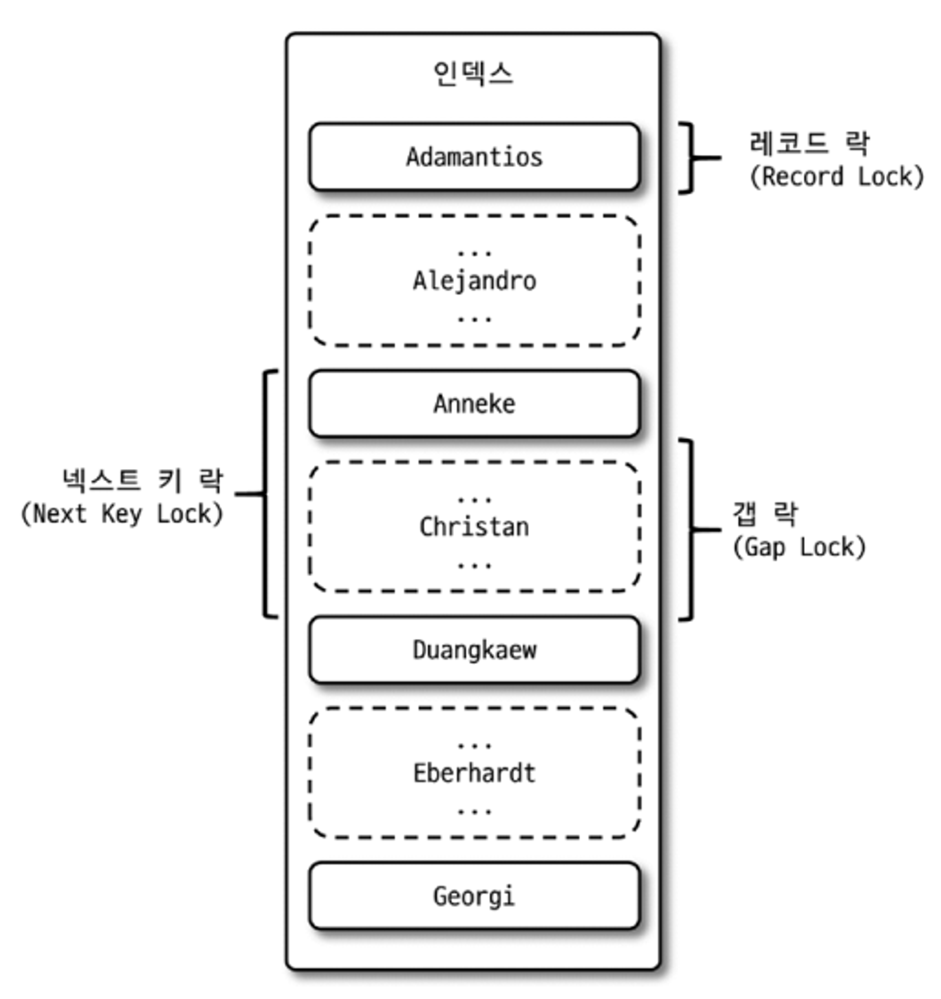

# 트랜잭션과 잠금

MySQL의 동시성에 영향을 미치는 잠금과 트랜잭션, 트랜잭션의 격리 수준을 살펴본다.

  

잠금과 트랜잭션은 서로 비슷한 개념 같지만,

**잠금**은 동시성을 제어하기 위한 기능이고, **트랜잭션**은 데이터의 정합성을 보장하기 위한 기능이다.

**격리 수준**은 하나의 트랜잭션 내에서 또는 여러 트랜잭션 간의 작업 내용을 어떻게 공유하고 차단할 것인지를 결정하는 레벨을 의미한다.

  

## 트랜잭션

InnoDB와 다르게, MyISAM이나 MEMORY 스토리지 엔진은 트랜잭션을 지원하지 않는다.

MyISAM이나 MEMORY 스토리지 엔진은 InnoDB 보다 사용하기 간단하지만,

트랜잭션을 지원하지 않기 때문에 더 많은 고민거리를 만들어 낸다.

  

**MySQL에서의 트랜잭션**

MyISAM이나 MEMORY 스토리지 엔진은 부분 업데이트(Partial Update) 현상으로 인해 데이터의 정합성을 맞추는 데 상당히 어려운 문제를 만들어 낸다.

  

```
mysql> SET autocommit=ON;

mysql> INSERT INTO tab_myisam (fdpk) VALUES (3);
mysql> INSERT INTO tab_myinnodb (fdpk) VALUES (3);

mysql> INSERT INTO tab_myisam (fdpk) VALUES (1),(2),(3);
ERROR 1062 (23000): Duplicate entry '3' for key 'PRIMARY'

mysql> SELECT * from tab_myisam;
+------+
| fdpk |
+------+
|    1 |
|    2 |
|    3 |
+------+

mysql> INSERT INTO tab_myinnodb (fdpk) VALUES (1),(2),(3);
ERROR 1062 (23000): Duplicate entry '3' for key 'PRIMARY'

mysql> SELECT * from tab_innodb;
+------+
| fdpk |
+------+
|    3 |
+------+
```

  

부분 업데이트 현상이 발생하면 실패한 쿼리로 인해 남은 레코드를 다시 삭제하는 재처리 작업이 필요하다.

  

**주의사항**

트랜잭션은 DBMS의 커넥션과 동일하게 꼭 필요한 최소의 코드에만 적용하는 것이 좋다.

즉, 프로그램의 코드가 데이터베이스 커넥션을 가지고 있는 범위와 트랜잭션이 활성화돼 있는 프로그램의 범위를 최소화해야 한다.

  

* * *

⁠⁠

## MySQL 엔진의 잠금

MySQL에서 사용되는 잠금은 크게 스토리지 엔진 레벨과 MySQL 엔진 레벨로 구분된다.

MySQL 엔진 레벨의 잠금은 모든 스토리지 엔진에 영향을 미치지만,

스토리지 엔진 레벨의 잠금은 스토리지 엔진 간 상호 영향을 미치지 않는다.

  

**글로벌 락(Global Lock)**

글로벌 락은 `FLUSH TABLES WITH READ LOCK` 명령으로 획득할 수 있으며 MySQL에서 제공하는 잠금 가운데 가장 범위가 크다.

범위가 가장 큰만큼 사용에 주의해야 한다.

  

**테이블 락(Table Lock)**

테이블 락은 개별 테이블 단위로 설정되는 잠금이며, 명시적 또는 묵시적으로 특정 테이블의 락을 획득할 수 있다.

명시적으로는 `LOCK TABLES table_name [ READ | WRITE ]` 명령으로 특정 테이블의 락을 획득할 수 있다.

하지만 명시적으로 테이블을 잠금는 작업은 글로벌 락과 동일하게 온라인 작업에 상당한 영향을 미칠 수 있기 때문에 특별한 상황이 아니면 애플레케이션에서 사용할 필요가 거의 없다.

  

묵시적인 테이블 락은 MyISAM이나 MEMORY 테이블에 데이터를 변경하는 쿼리를 실행하면 발생한다.

즉, 묵시적인 테이블 락은 쿼리가 실행되는 동안 자동으로 획득됐다가 쿼리가 완료된 후 자동 해제된다.

하지만 InnoDB 테이블의 경우 스토리지 엔진 차원에서 레코드 기반의 잠금을 제공하기 때문에 단순 데이터 변경 쿼리로 인해 묵시적인 테이블 락이 설정되지는 않는다.

정확히는 테이블 락이 설정되지만 대부분의 데이터 변경(DML) 쿼리에서는 무시되고 스키마를 변경하는 쿼리(DDL)의 경우에만 영향을 미친다.

  

**네임드 락(Named Lock)**

네임드 락은 `GET_LOCK()` 함수를 이용해 임의의 문자열에 대해 잠금을 설정할 수 있다.

이 잠금의 특징은 대상이 테이블이나 레코드 또는 AUTO\_INCREMENT와 같은 데이터베이스 객체가 아니라,

사용자가 지정한 문자열에 대해 획득하고 반납하는 잠금이라는 점이다.

많은 레코드에 대해서 복잡한 요건으로 레코드를 변경하는 트랜잭션에 유용하게 사용할 수 있다.

  

**메타데이터 락(Metadata Lock)**

메타데이터 락은 데이터베이스 객체의 이름이나 구조를 변경하는 경우에 획득하는 잠금이다.

메타데이터 락은 명시적으로 획득하거나 해제할 수 있는 것이 아니고,

“RENAME TABLE tab\_a TO tab\_b” 같이 테이블의 이름을 변경하는 경우 자동으로 획득하는 잠금이다.

  

* * *

  

## InnoDB 스토리지 엔진의 잠금

InnoDB 스토리지 엔진은 MySQL에서 제공하는 잠금과는 별개로,

스토리지 엔진 내부에서 레코드 기반의 잠금 방식을 탑재하고 있다.

레코드 기반의 잠금 방식 때문에 MyISAM 보다는 훨씬 뛰어난 동시성 처리를 제공한다.

  

일반 상용 DBMS와는 조금 다르게 InnoDB 스토리지 엔진에서는 레코드 락뿐 아니라,

레코드와 레코드 사이의 간격을 잠그는 갭(GAP) 락이라는 것이 존재한다.

  

  

  

**레코드 락(Record Lock)**

InnoDB 스토리지 엔진은 레코드 자체가 아니라 인덱스의 레코드를 잠근다.

인덱스가 하나도 없는 테이블이더라도 내부적으로 자동 생성된 클러스터 인덱스를 이용해 잠금을 설정한다.

  

**갭 락(Gap Lock)**

갭 락은 레코드 자체가 아니라 레코드와 바로 인접한 레코드 사이의 간격만을 잠근다.

레코드와 레코드 사이의 간격에 새로운 레코드가 생성되는 것을 제어한다.

  

**넥스트 키 락(Next key Lock)**

레코드 락과 갭 락을 합쳐 놓은 형태의 잠금을 넥스트 키 락이라고 한다.

바이너리 로그에 기록되는 쿼리가 레플리카 서버에서 실행될 때 소스 서버에서 만들어 낸 결과와 동일한 결과를 만들어내도록 보장하는 것이 주목적이다.

넥스트 키 락과 갭 락으로 인해 데드락이나 다른 트랙잭션을 기다리게 만드는 일이 자주 발생하므로 가능하다면 바이너리 로그 포맷을 ROW 형태로 바꿔서 넥스트 키 락이나 갭 락을 줄이는 것이 좋다.

  

**자동 증가 락**

자동 증가 락은 `AUTO_INCREMENT` 칼럼을 위한 테이블 수준의 잠금이다.

`INSERT`와 `REPLACE` 쿼리 문장과 같이 새로운 레코드를 저장하는 쿼리에서만 필요하다.

명시적으로 획득하고 해제하는 방법은 없다.

  

MySQL 서버가 `INSERT` 되는 레코드의 건수를 정확히 예측할 수 있을 때는 자동 증가 락을 사용하지 않고, 훨씬 가볍고 빠른 래치(뮤텍스)를 이용해 처리한다.

`innodb_autoinc_lock_mode` 시스템 변수를 이용해 자동 증가 락의 작동 방식을 변경할 수 있다.

  

자동 증가 값이 한 번 증가하면 절대 줄어들지 않는 이유가 `AUTO_INCREMENT` 잠금을 최소화하기 위해서다.

  

* * *

  

## 인덱스와 잠금

InnoDB의 잠금은 레코드를 잠그는 것이 아니라, 인덱스를 잠그는 방식으로 처리된다.

즉, 변경해야 할 레코드를 찾기 위해 검색한 인덱스의 레코드를 모두 락을 걸어야 한다.

만약 테이블에 인덱스가 하나도 없다면 `UPDATE` 작업 시 테이블에 있는 모든 레코드를 잠그게 된다.

이게 MySQL의 방식이며, MySQL의 InnoDB에서 인덱스 설계가 중요한 이유 또한 이것이다.

  

* * *

  

## 레코드 수준의 잠금 확인 및 해제

테이블 잠금에서는 잠금의 대상이 테이블 자체이므로 쉽게 문제의 원인이 해결될 수 있지만,

레코드 수준의 잠금은 테이블의 레코드 각각에 잠금이 걸리므로 자주 사용되지 않는다면 오랜 시간 동안 잠겨진 상태로 남아 있어도 잘 발견되지 않는다.

  

* * *

  

## MySQL의 격리 수준

트랜잭션의 격리 수준이란 여러 트랜잭션이 동시에 처리될 때 특정 트랜잭션이 다른 트랜잭션에서 변경하거나 조회하는 데이터를 볼 수 있게 허용할지 말지를 결정하는 것이다.

  

**격리 수준**

- READ UNCOMMITTED : 일반적인 데이터베이스에서는 거의 사용하지 않음
- READ COMMITTED
- REPEATABLE READ
- SERIALIZABLE : 동시성이 중요한 데이터베이스에서는 거의 사용되지 않음

  

**READ UNCOMMITTED**

각 트랜잭션에서의 변경 내용이 COMMIT이나 ROLLBACK 여부에 상관없이 다른 트랜잭션에서 보인다.

  

  

  

**더티 리드**가 허용되는 격리 수준이 READ UNCOMMITTED다.

이 현상은 데이터가 나타났다가 사라졌다 하는 현상을 초래하므로 애플리케이션 개발자와 사용자를 상당히 혼란스럽게 만든다.

  

> 더티 리드(Dirty Read)  
> : 어떤 트랜잭션에서 처리한 작업이 완료되지 않았는데도 다른 트랜잭션에서 볼 수 있는 현상

  

**READ COMMITTED**

어떤 트랜잭션에서 데이터를 변경했더라도 COMMIT이 완료된 데이터만 다른 트랜잭션에서 조회할 수 있다.

  

  

  

하지만 READ COMMITTED 격리 수준에서도 “NON-REPEATABLE READ”라는 부정합의 문제가 있다.

사용자가 하나의 트랜잭션 내에서 똑같은 SELECT 쿼리를 실행했을 때 항상 같은 결과를 가져와야 한다는 “REPEATABLE READ” 정합성에 어긋나는 상황이 발생할 수 있다.

  

  

  

**REPEATABLE READ**

바이너리 로그를 가진 MySQL 서버에서는 최소 REPEATABLE READ 격리 수준 이상을 사용해야 한다.

REPEATABLE READ와 READ COMMITTED의 차이는,

언두 영역에 백업된 레코드의 여러 버전 가운데 몇 번째 이전 버전까지 찾아 들어가야 하느냐에 있다.

  

  

  

모든 InnoDB의 트랜잭션은 고유한 트랜잭션 번호(순차적으로 증가하는 값)를 가지며 언두 영역에 백업된 모든 레코드에는 변경을 발생시킨 트랜잭션의 번호가 포함돼 있다.

REPEATABLE READ 격리 수준에서는 MVCC를 보장하기 위해 실행 중인 트랜잭션 가운데 가장 오래된 트랜잭션 번호보다 번호가 앞선 언두 영역의 데이터는 삭제할 수 없다.

하지만 장시간 트랜잭션을 종료하지 않으면 언두 영역이 백업된 데이터로 무한정 커질 수도 있다.

이렇게 언두에 백업된 레코드가 많아지면 MySQL 서버의 처리 성능이 떨어질 수 있다.

  

> PHANTOM READ  
> : 다른 트랜잭션에서 수행한 변경 작업에 의해 레코드가 보였다 안 보였다 하는 현상  

  

**SERIALIZABLE**

가장 단순한 격리 수준이면서 동시에 가장 엄격한 격리 수준이다.

그만큼 동시 처리 성능도 다른 트랜잭션 격리 수준보다 떨어진다.

SERIALIZABLE 격리 수준에서는 일반적인 DBMS에서 일어나는 “PHANTOM READ”라는 문제가 발생하지 않는다.

하지만, InnoDB 스토리지 엔진에서는 갭 락과 넥스트 키 락 덕분에 REPEATABLE READ 격리 수준에서도 “PHANTOM READ”가 발생하지 않기 때문에 굳이 SERIALIZABLE을 사용할 필요성이 없다.

  

#MySQL